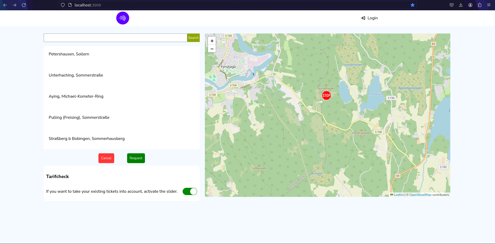
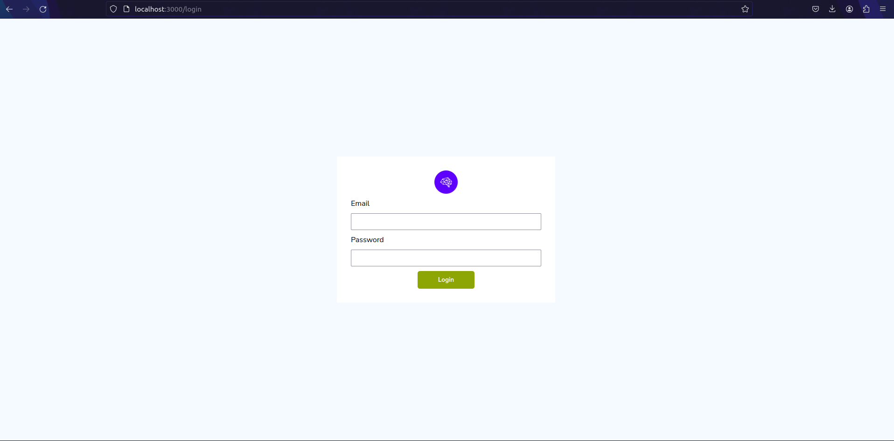

# Planning tool
## Overview
This React application serves as a planning tool, featuring two main pages: a login page and a home page. Each page is modularized into components, with the home page, for instance, comprising three components responsible for map rendering, search functionality, and the navigation bar. Each component manages its own state and functionality.

For API consumption, I integrated React Query, a robust library for efficient data fetching from servers. However, encountering Cross-Origin Resource Sharing (CORS) issues prompted the implementation of a proxy server to circumvent this problem. In simpler terms, a proxy server acts as an intermediary between the client (React app) and the API server, helping to bypass CORS restrictions and facilitate smooth communication.

To enhance mapping capabilities, React Leaflet, a powerful library tailored for maps, was employed in the implementation.

## Screenshots
### Home page


### Login page



## Local Setup

### Prerequisites
Ensure that React is installed on your machine.

### 1. Download Repository
Clone the repository using the following command:
```bash
git clone [repository_url]
```
### 2. Install Dependencies
Open the project in your preferred code editor and run the following command to install all required dependencies:
```bash
npm install
```

### 3. Start Development Server
After installing the packages, initiate the development server:
```bash
npm start
```
### 4. Access Locally
Open your web browser and navigate to:
```bash
http://localhost:3000
```
This will launch the React application on your local machine, and you can access it through your web browser at the specified localhost address.


